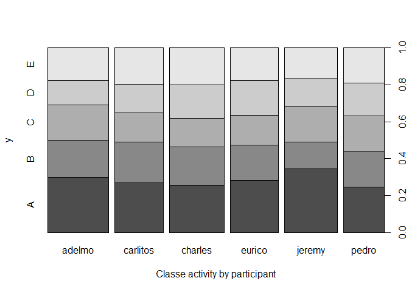
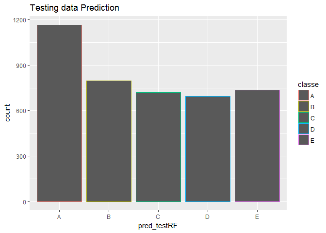

# Practical Machine Learning Course Project
Nsi J.  
7 juillet 2017  

# Executive summary   

Using devices such as Jawbone Up, Nike FuelBand, and Fitbit it is now possible to collect a large amount of data about personal activity relatively inexpensively. These type of devices are part of the quantified self movement. The data come from  see <http://groupware.les.inf.puc-rio.br/har#weight_lifting_exercises>    

# The goal of the project     

One thing that people regularly do is quantify how much of a particular activity they do, but they rarely quantify how well they do it. In this project, the goal will be to use data from accelerometers on the belt, forearm, arm, and dumbell of 6 participants". They were asked to perform barbell lifts correctly and incorrectly in 5 different ways.    

# Set the work directory


# Load data and get data


```r
# Load data
Trainurl <- 'https://d396qusza40orc.cloudfront.net/predmachlearn/pml-training.csv'
Testurl  <- 'https://d396qusza40orc.cloudfront.net/predmachlearn/pml-testing.csv'
if (!file.exists("data")) dir.create("data")
if (!file.exists("pml-training.csv")) download.file(Trainurl, destfile1 ="data/pml-training.csv", mode="wb")
if (!file.exists("pml-testing.csv")) download.file(Testurl, destfile2 ="data/pml-testing.csv", mode="wb")
library(dplyr)
```

```
## 
## Attaching package: 'dplyr'
```

```
## The following objects are masked from 'package:stats':
## 
##     filter, lag
```

```
## The following objects are masked from 'package:base':
## 
##     intersect, setdiff, setequal, union
```

```r
library(data.table)
```

```
## -------------------------------------------------------------------------
```

```
## data.table + dplyr code now lives in dtplyr.
## Please library(dtplyr)!
```

```
## -------------------------------------------------------------------------
```

```
## 
## Attaching package: 'data.table'
```

```
## The following objects are masked from 'package:dplyr':
## 
##     between, first, last
```

```r
# Read data

training <-read.csv("pml-training.csv",header=TRUE, sep=",", na.strings=c("NA","", "#DIV/0!"))
testingVal <-read.csv("pml-testing.csv",header=TRUE, sep=",", na.strings = c("NA","", "#DIV/0!"))
```

# Perform basic exploratory data analysis

```r
# Structure of the dataset
# str(training)
## 'data.frame':	19622 obs. of  160 variables
#dim(training)
#[1] 19622   160
# View(training)
## Many rows with NA data,#DIV/0! values,"" 
which(colnames(training)=="classe")
```

```
## [1] 160
```

```r
(table(training$classe))
```

```
## 
##    A    B    C    D    E 
## 5580 3797 3422 3216 3607
```

```r
table(training$user_name)
```

```
## 
##   adelmo carlitos  charles   eurico   jeremy    pedro 
##     3892     3112     3536     3070     3402     2610
```

```r
table(training$user_name, training$classe)
```

```
##           
##               A    B    C    D    E
##   adelmo   1165  776  750  515  686
##   carlitos  834  690  493  486  609
##   charles   899  745  539  642  711
##   eurico    865  592  489  582  542
##   jeremy   1177  489  652  522  562
##   pedro     640  505  499  469  497
```

```r
# Classe A has the highest value for the 6 participants
plot(training$user_name, training$classe, xlab="Classe activity by participant")
```

<!-- -->

```r
#str(testingVal)
## data.frame':	20 obs. of  160 variables
# names(testingVal)
# which(colnames(testingVal)=="classe")
# Testing does not contain classe named column
# View(testingVal)
```
# Basic Preprocessing

```r
# Math functions as mean, sd, max, colSums...all take the na.rm argument, TRUE ie missing values are omitted
# see <http://faculty.nps.edu/sebuttre/home/R/missings.html>

training <- training[, colSums(is.na(training)) == 0]
#dim(training)
# [1] 19622    60
# New data set with only 19622 observations and 60 variables instead of 19622 observations and 160 variables

testingVal <- testingVal[, colSums(is.na(testingVal)) == 0]

#dim(testingVal)
# [1] 20 60
# New data set with only 20 observations and 60 variables instead of 20 observations and 160 variables
```
# Steps by Steps to predict the manner in which the participants did the exercise   
## Analysis steps in train/test and validation datasets


```r
# Training dataset
library(caret)
```

```
## Loading required package: lattice
```

```
## Loading required package: ggplot2
```

```r
set.seed(2433)

# CROSS VALIDATION : how to detect relevant features and build models 
# DATA SPLITTING
inTrain <- createDataPartition(training$classe, p=0.70, list=F)
training <- training[inTrain, ]
testing <- training[-inTrain, ]
# dim(training)
## [1] 13737    60
# View(training)
# which(colnames(training)=="classe")
## [1] 60
# dim(testing)
## [1] 4141   60

# The effect of all the variables on the outcome classe with : the choice of the method  randomforest as it knowns to be more accuracy and usually one of the two top performing algorithms along with boosting in prediction contexts
library(randomForest)
```

```
## randomForest 4.6-12
```

```
## Type rfNews() to see new features/changes/bug fixes.
```

```
## 
## Attaching package: 'randomForest'
```

```
## The following object is masked from 'package:ggplot2':
## 
##     margin
```

```
## The following object is masked from 'package:dplyr':
## 
##     combine
```

```r
library(mlbench)
library(caret)
library(parallel)
library(doParallel)
```

```
## Loading required package: foreach
```

```
## Loading required package: iterators
```

```r
cluster <- makeCluster(detectCores() - 1) # convention to leave 1 core for OS
registerDoParallel(cluster)
fitControl <- trainControl(method = "cv", number = 10, allowParallel = TRUE)
library(foreach)
library(iterators)

# FIT A MODEL 
set.seed(3135)
modelRf <- train(classe ~ ., method="rf",data=training,trControl = fitControl)
modelRf
```

```
## Random Forest 
## 
## 13737 samples
##    59 predictor
##     5 classes: 'A', 'B', 'C', 'D', 'E' 
## 
## No pre-processing
## Resampling: Cross-Validated (10 fold) 
## Summary of sample sizes: 12363, 12364, 12363, 12365, 12362, 12361, ... 
## Resampling results across tuning parameters:
## 
##   mtry  Accuracy   Kappa    
##    2    0.9944670  0.9930012
##   41    0.9997817  0.9997238
##   81    0.9997088  0.9996317
## 
## Accuracy was used to select the optimal model using  the largest value.
## The final value used for the model was mtry = 41.
```

```r
## Random Forest 

## 13737 samples
##    59 predictor
##    5 classes: 'A', 'B', 'C', 'D', 'E' 

##No pre-processing
##Resampling: Cross-Validated (10 fold) 
##Summary of sample sizes: 12364, 12363, 12364, 12364, 12363, 12362, ... 
##Resampling results across tuning parameters:

##  mtry  Accuracy   Kappa    
##  2     0.9948307  0.9934613
##  41    0.9998544  0.9998158
##  81    0.9998544  0.9998158

##Accuracy was used to select the optimal model using  the largest value.
##The final value used for the model was mtry = 41.

stopCluster(cluster)
registerDoSEQ()

# ACCURACY of the model RandomForest :Steps to evaluate the suitability of this model

pred_rf <- predict(modelRf, training)
# confusionMatrix(pred_rf, training$classe)
##Confusion Matrix and Statistics

##          Reference
##Prediction    A    B    C    D    E
##         A 3906    0    0    0    0
##         B    0 2658    0    0    0
##         C    0    0 2396    0    0
##         D    0    0    0 2252    0
##         E    0    0    0    0 2525

##Overall Statistics
                                     
##               Accuracy : 1          
##                 95% CI : (0.9997, 1)
##    No Information Rate : 0.2843     
##    P-Value [Acc > NIR] : < 2.2e-16  
                                     
##                  Kappa : 1          
## Mcnemar's Test P-Value : NA         

##Statistics by Class:

##                     Class: A Class: B Class: C Class: D Class: E
##Sensitivity            1.0000   1.0000   1.0000   1.0000   1.0000
##Specificity            1.0000   1.0000   1.0000   1.0000   1.0000
##Pos Pred Value         1.0000   1.0000   1.0000   1.0000   1.0000
##Neg Pred Value         1.0000   1.0000   1.0000   1.0000   1.0000
##Prevalence             0.2843   0.1935   0.1744   0.1639   0.1838
##Detection Rate         0.2843   0.1935   0.1744   0.1639   0.1838
##Detection Prevalence   0.2843   0.1935   0.1744   0.1639   0.1838
##Balanced Accuracy      1.0000   1.0000   1.0000   1.0000   1.0000

# RESULT : The method RandomForest has an accurary nearly about 100% on the confidence interval of 95%

# THE FINAL MODEL
# Adding some parameters to see the out of bag (OOB) error which is the overall classification error during training, by both class and ntree
modelfinalRf <- train(classe ~ ., method="rf",data=training,trControl = fitControl, importance=TRUE, ntree=50, do.trace=F)

pred_RF <- predict(modelfinalRf, training)
confusionMatrix(pred_RF, training$classe)
```

```
## Confusion Matrix and Statistics
## 
##           Reference
## Prediction    A    B    C    D    E
##          A 3906    0    0    0    0
##          B    0 2658    0    0    0
##          C    0    0 2396    0    0
##          D    0    0    0 2252    0
##          E    0    0    0    0 2525
## 
## Overall Statistics
##                                      
##                Accuracy : 1          
##                  95% CI : (0.9997, 1)
##     No Information Rate : 0.2843     
##     P-Value [Acc > NIR] : < 2.2e-16  
##                                      
##                   Kappa : 1          
##  Mcnemar's Test P-Value : NA         
## 
## Statistics by Class:
## 
##                      Class: A Class: B Class: C Class: D Class: E
## Sensitivity            1.0000   1.0000   1.0000   1.0000   1.0000
## Specificity            1.0000   1.0000   1.0000   1.0000   1.0000
## Pos Pred Value         1.0000   1.0000   1.0000   1.0000   1.0000
## Neg Pred Value         1.0000   1.0000   1.0000   1.0000   1.0000
## Prevalence             0.2843   0.1935   0.1744   0.1639   0.1838
## Detection Rate         0.2843   0.1935   0.1744   0.1639   0.1838
## Detection Prevalence   0.2843   0.1935   0.1744   0.1639   0.1838
## Balanced Accuracy      1.0000   1.0000   1.0000   1.0000   1.0000
```

```r
# Result with adding parameters : The method RandomForest still has an accuracy nearly about 100% on the confidence interval of 95%

# PREDICTION ON TESTING DATASET : Accuracy of the model on testing data set? 

pred_testRF <- predict(modelfinalRf, testing)
#confusionMatrix(pred_testRF, testing$classe)
##Confusion Matrix and Statistics

##          Reference
##Prediction    A    B    C    D    E
##         A 1165    0    0    0    0
##         B    0  797    0    0    0
##         C    0    0  719    0    0
##         D    0    0    0  693    0
##         E    0    0    0    0  737

##Overall Statistics
                                     
##               Accuracy : 1          
##                 95% CI : (0.9991, 1)
##    No Information Rate : 0.2834     
##    P-Value [Acc > NIR] : < 2.2e-16  
                                     
##                  Kappa : 1          
## Mcnemar's Test P-Value : NA         

##Statistics by Class:

##                     Class: A Class: B Class: C Class: D Class: E
##Sensitivity            1.0000   1.0000   1.0000   1.0000   1.0000
##Specificity            1.0000   1.0000   1.0000   1.0000   1.0000
##Pos Pred Value         1.0000   1.0000   1.0000   1.0000   1.0000
##Neg Pred Value         1.0000   1.0000   1.0000   1.0000   1.0000
##Prevalence             0.2834   0.1939   0.1749   0.1686   0.1793
##Detection Rate         0.2834   0.1939   0.1749   0.1686   0.1793
##Detection Prevalence   0.2834   0.1939   0.1749   0.1686   0.1793
##Balanced Accuracy      1.0000   1.0000   1.0000   1.0000   1.0000

# The method RandomForest has an accurary nearly about 100% (99.91%)on the confidence interval of 95% though a little bit less than the one on training data set(99.97%)

# The expected OUT OF SAMPLE ERROR 
# It is supposed to be larger than in sample error which you get on the same data set used to build your predictors
# From the confusionMatrix, we have the value of accuracy. Accuracies are also computed as accuracies = 1 - errors => errors = 1 - accuracies
#see < https://stackoverflow.com/questions/28666066/get-the-accuracy-of-a-random-forest-in-r)>

# Err <- 1 - 0.9991)
## Err
## [1] 9e-04
## The err is about 0.09%

library(ggplot2)

qplot(pred_testRF, color=classe, data=testing, main='Testing data Prediction')
```

<!-- -->

```r
# The classe A is the most highest one among 5 activities

# VALIDATION PART: Apply the machine learning algorithm to the 20 test cases 


validation <-testingVal


pred_validRF <- predict(modelfinalRf,validation)
#pred_validRF
##  [1] A A A A A A A A A A A A A A A A A A A A
## Levels: A B C D E


# Evaluate on Validation
# names(validation)

pred_validRF <- as.numeric(pred_validRF)
# sqrt(sum(pred_validRF-60)^2)  --minus the column named classe (training data set)
## [1] 1180
```

# Conclusion   
After exploring data, then handling missing values the data has been splitted into training/testing, respectively 70/30. The choice of randomforest method to fit a model seems to be the best on this context of predictions with an accuracy close to 100% with 60 variables, with an error less than 0 on testing data. Howerver, the drawback might be the overfitting of all of the 60 variables in this model.

